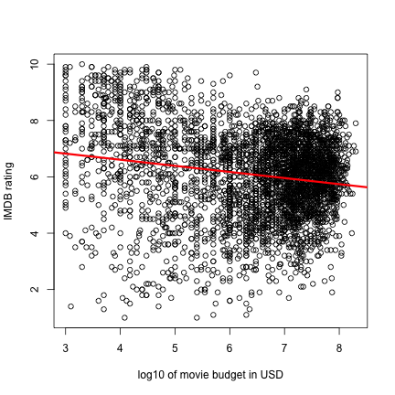
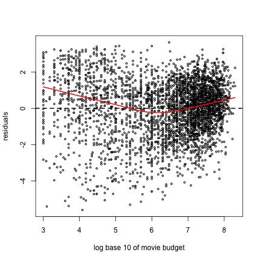

Are Higher Movie Budgets Associated with Higher IMDB Ratings for Movies Made from 1980-2005?
========================================================
We load the `ggplot2` R package first, then the data.

```r
if (!is.element("ggplot2", rownames(installed.packages()))) {
    install.packages("ggplot2")
}
library(ggplot2)
data(movies)
options(width = 150)
```


Data Cleaning
--------------------------------------------------------
Let's only consider movies between 1980 and 2005 who have non-missing non-zero budgets.

```r
movies <- subset(movies, movies$budget != 0 & !is.na(movies$budget))
movies <- subset(movies, movies$year >= 1980 & movies$year <= 2005)
```


You should always explore the data before doing any kind of statistical analysis.  Here is some information on the top 10 most expensive movies in the dataset:

```r
movies[order(movies$budget, decreasing = TRUE)[1:10], 1:6]
```

```
##                                                 title year length    budget rating votes
## 48518                                    Spider-Man 2 2004    127 200000000    7.9 40256
## 52348                                         Titanic 1997    194 200000000    6.9 90195
## 53437                                            Troy 2004    162 185000000    7.1 33979
## 51244              Terminator 3: Rise of the Machines 2003    109 175000000    6.9 32111
## 56212                                      Waterworld 1995    176 175000000    5.4 19325
## 57122                                  Wild Wild West 1999    107 170000000    4.0 19078
## 54891                                     Van Helsing 2004    132 160000000    5.4 19787
## 1559                                        Alexander 2004    175 150000000    5.5 11254
## 32635 Master and Commander: The Far Side of the World 2003    138 150000000    7.5 21328
## 40603                              Polar Express, The 2004     99 150000000    6.8  4045
```


Here is some information on the top 10 highest rated movies in the dataset:

```r
movies[order(movies$rating, decreasing = TRUE)[1:10], 1:6]
```

```
##                                  title year length budget rating votes
## 49846                 Summer Sonata, A 2004     30   2000   10.0     5
## 5898                      Black Canyon 2004     25   3000    9.9     9
## 13909 Dimensia Minds Trilogy: The Reds 2004      8   1200    9.9    15
## 15019                         Drifting 2004     21   3000    9.9    41
## 27510               Keeper of the Past 2005     18  30000    9.9     7
## 37399                           Of Age 2004      5   1000    9.9     7
## 40458          Plight of Clownana, The 2004     15   6000    9.9    11
## 20878                 Goodnite Charlie 2005    119 100000    9.8    34
## 24411                   I Am My Resume 2003     15  30000    9.8     5
## 25397           Innocence Project, The 2004     26   1000    9.8     6
```


Budgets and Ratings
--------------------------------------------------------
Let's look at a histogram of movie budgets.  The data is extremely right skewed: 

```r
movies <- subset(movies, movies$budget != 0 & !is.na(movies$budget))
movies <- subset(movies, movies$year >= 1980 & movies$year <= 2005)
hist(movies$budget, xlab = "movie budget in USD", main = "Movie Budgets")
```

 


What's often done in statistics/economics is to consider the log of the data to spread it out and consider "orders of magnitude".  Let's take log base 10 so that we easily mark thousands, millions, etc:


```r
movies$log10.budget <- log10(movies$budget)
hist(movies$log10.budget, xlab = "log10 of movie budget in USD", main = "log Base 10 of Movie Budgets")
```

 


Here are the average IMDB user ratings

```r
hist(movies$rating, xlab = "IMDB rating", main = "Movie Rating")
```

 


Relationship 
--------------------------------------------------------
And here is a scatter plot of movie budgets vs ratings, along with the regression line.  

```r
plot(movies$log10.budget, movies$rating, xlab = "log10 of movie budget in USD", ylab = "IMDB rating")
regression <- lm(movies$rating ~ movies$log10.budget)
abline(regression, col = "red", lwd = 3)
```

 


It looks negatively sloped!  i.e. assuming a linear model, as movie budgets go up its IMDB rating goes down.  


```r
summary(regression)
```

```
## 
## Call:
## lm(formula = movies$rating ~ movies$log10.budget)
## 
## Residuals:
##    Min     1Q Median     3Q    Max 
## -5.591 -0.962  0.174  1.074  3.630 
## 
## Coefficients:
##                     Estimate Std. Error t value Pr(>|t|)    
## (Intercept)           7.4758     0.1281    58.3   <2e-16 ***
## movies$log10.budget  -0.2170     0.0196   -11.1   <2e-16 ***
## ---
## Signif. codes:  0 '***' 0.001 '**' 0.01 '*' 0.05 '.' 0.1 ' ' 1
## 
## Residual standard error: 1.54 on 3717 degrees of freedom
## Multiple R-squared:  0.0318,	Adjusted R-squared:  0.0316 
## F-statistic:  122 on 1 and 3717 DF,  p-value: <2e-16
```


So the interpretation is: for 
* every increase of 1 in $\log_{10}$ of the movie budget
* or stated differently, every multiplicative increase of $10^1 = 10$ in the movie budget

we observed a decrease of -0.2170 in the IMDB rating of the movie. If the assumptions of linear regression hold, then a 95\% confidence interval of this estimate is $\mbox{point estimate} \pm 1.96 \times SE = -0.2170 \pm 1.96 \times 0.01963 = (-0.2555, -0.1785)$


Diagnostic Plots
--------------------------------------------------------
However, we must verify the assumptions of linear regression to be able to trust the confidence intervals and hypothesis tests. Here is a histogram of the residuals $e_i = y_i - \widehat{y}_i$.  They are not quite centered and symmetric about 0.

```r
residuals <- residuals(regression)
hist(residuals, main = "Residuals", breaks = 20)
abline(v = 0, lwd = 2, lty = 2)
```

 


Taking a look at a QQ-plot of the residuals, they deviate a bit from being normal.  

```r
qqnorm(residuals)
qqline(residuals)
```

 


Finally, we have a residual plot to verify the assumption of constant variance.  The red line is a ``smoothing function'' that goes through the points and attempts to separate an underlying trend from the noise.  

```r
plot(movies$log10.budget, residuals, cex = 0.5, xlab = "log base 10 of movie budget")
abline(h = 0, lwd = 2, lty = 2)
lines(lowess(movies$log10.budget, residuals), col = "red", lwd = 2)
```

 


What are some issues with the analysis?
--------------------------------------------------------


